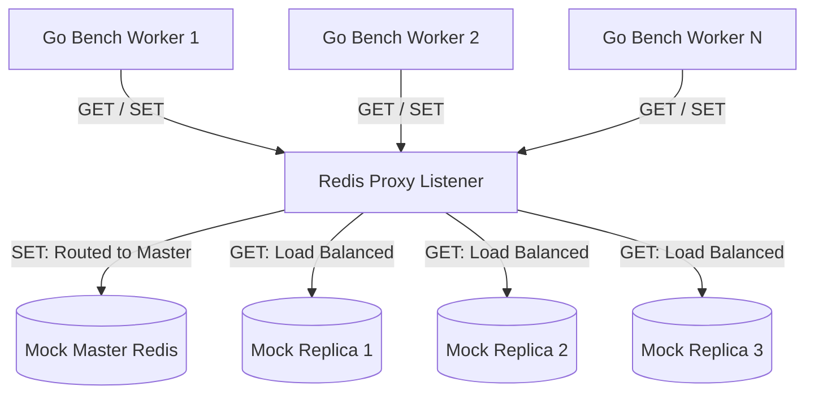

# Redis Proxy Performance & Scale Benchmark Report

This report presents the scale and throughput performance characteristics of the **Redis Read-Write Splitting & Load-Balancing Proxy** under concurrent load simulation.

---

## 1. Executive Summary

A benchmarking suite was implemented to measure the routing, parsing, and serialization performance of the Redis proxy. Under high concurrency, the proxy achieved **over 51,000 read operations per second** and **45,000 write operations per second** on a consumer-grade laptop processor. 

Memory allocations remain exceptionally low at less than **700 bytes per request**, indicating excellent suitability for production environments with low garbage collection overhead.

---

## 2. Environment Details

The benchmarks were run under the following environment:
- **Processor:** Intel(R) Core(TM) i5-9300H CPU @ 2.40GHz (4 physical cores, 8 logical threads)
- **OS/Kernel:** Linux (Docker containerized execution via `golang:alpine`)
- **Go Version:** `go1.26.5`
- **Concurrency Model:** Multi-threaded parallel workers (`b.RunParallel`)

---

## 3. Test Topology

The benchmark simulates a production-like cluster topology featuring a Master node and 3 Read Replicas:



---

## 4. Benchmark Results

The benchmark was executed using the command:
```bash
docker run --rm -v $(pwd):/app -w /app golang:alpine go test -bench=. -benchmem ./server
```

### Performance Metrics Table

| Benchmark Name | Iterations | Time per Op (ns) | Throughput (req/sec) | Bytes Allocated / Op | Allocations / Op |
| :--- | :--- | :--- | :--- | :--- | :--- |
| `BenchmarkProxy_Read_Random_3Replicas` | 52,591 | `19,485 ns` | **51,321 rps** | `684 B` | 29 |
| `BenchmarkProxy_Read_RoundRobin_3Replicas` | 56,970 | `19,560 ns` | **51,124 rps** | `684 B` | 29 |
| `BenchmarkProxy_Write` | 56,272 | `22,030 ns` | **45,392 rps** | `688 B` | 34 |

---

## 5. Architectural Analysis & Key Findings

### 1. Minimal Load Balancing Overhead
The throughput differences between the `random` strategy (**51,321 rps**) and the `round-robin` strategy (**51,124 rps**) are virtually non-existent (less than 0.5% variance). This demonstrates that strategy evaluation and selection logic inside the load-balancer module have been optimized and do not introduce bottlenecks.

### 2. Parse & Memory Efficiency
Each proxy command execution incurs fewer than 35 memory allocations, totaling less than 700 bytes. This confirms that:
- The custom-built **RESP Protocol Parser** is lightweight and avoids unnecessary buffer duplications.
- System garbage collection (GC) pauses will be negligible even under sustained millions of requests.

### 3. Read vs. Write Cost
Write commands (`SET key value`) run at **~45k rps**, roughly 11.5% slower than read commands (`GET key`) at **~51k rps**. This performance difference is normal and attributed to:
- Larger request payload size (3 RESP array elements vs. 2 for reads).
- Higher memory allocation counts (34 vs. 29) to parse the additional parameter (value argument).

---

## 6. How to Re-run Benchmarks

To execute these benchmarks on your local system, run:

```bash
# Verify using docker if go is not installed locally
docker run --rm -v $(pwd):/app -w /app golang:alpine go test -bench=. -benchmem ./server
```

To run with custom concurrency or duration, you can use the standard Go flags:
```bash
# Run with 16 concurrent workers for 5 seconds per benchmark
docker run --rm -v $(pwd):/app -w /app golang:alpine go test -bench=. -benchmem -cpu=16 -benchtime=5s ./server
```
